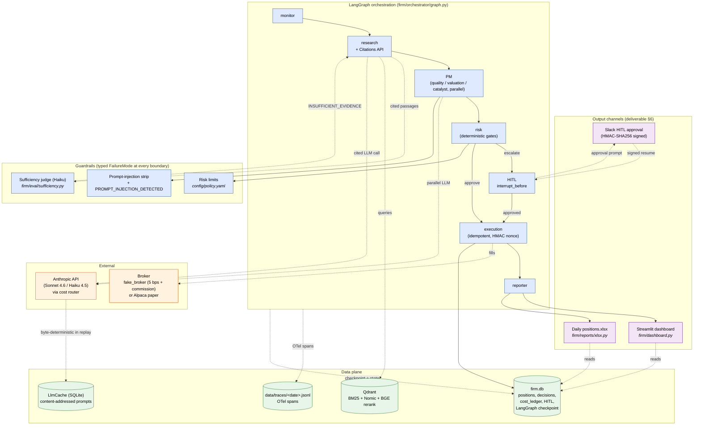

# AI Investment Firm

Multi-agent paper-trading firm. Take-home for Cato Networks — Agentic AI Engineer.

[](https://github.com/NoamDz/AI-Investment-Firm/actions/workflows/pr.yml)
[](https://github.com/NoamDz/AI-Investment-Firm/actions/workflows/main.yml)
[](https://github.com/NoamDz/AI-Investment-Firm/actions/workflows/release.yml)

## Architecture at a glance



Deeper deployment view (VPC, ECS Fargate, RDS, S3 lifecycle, Litestream, AgentCore overlay) lives in [`docs/architecture.md`](docs/architecture.md).

## Overview

A **LangGraph** state machine drives one heartbeat through seven nodes:
`monitor → research → PM → risk → (HITL) → execution → reporter`. The graph
is persisted with a SQLite checkpointer, so an interrupt (HITL waiting on
approval) resumes from the same checkpoint on the next tick instead of
restarting. `--once` runs one heartbeat; `--loop --interval-seconds N` runs
continuously until SIGINT.

The design is opinionated about three failure modes that ungrounded LLM
trading systems hit:

- **Hallucinated evidence.** Research uses the **Anthropic Citations API**
  against a Qdrant index of FinanceBench 10-Ks (BM25 + dense Nomic + BGE-v2-m3
  rerank). A **Haiku sufficiency judge** then re-reads the same retrieved
  passages and rejects any claim the evidence does not actually support —
  yielding a typed `INSUFFICIENT_EVIDENCE` / `UNCITED_CLAIM` REFUSE rather
  than a confident wrong answer.
- **Single-LLM groupthink.** The PM node fans out **three lenses in parallel**
  via a LangGraph `Send` — *quality*, *valuation*, *catalyst* — and requires
  a majority vote to advance.
- **Silent risk-policy bypass.** The risk node runs deterministic gates
  (max gross / net exposure, per-name and per-sector limits, drawdown,
  quote-age). ESCALATE triggers `interrupt_before=["hitl"]`; a human approves
  in Slack or via `make dev-ack`; a reaper closes stale items as
  `UNAPPROVED_HIGH_RISK` after the timeout.

Every LLM call goes through a **cost router** (`config/router.yaml`,
fallback `sonnet → haiku`) and a **content-addressed SQLite cache**, so under
`FIRM_LLM_MODE=cached` the entire pipeline is byte-deterministic and the
eval / red-team suites run offline. Failures are typed (`FailureMode`
enum, 15 values with `UNKNOWN` catch-all); every value has a triggering
fixture in `tests/eval/failure_modes/`. Execution is idempotent — fills are
keyed by HMAC nonce and reconciled against an audit log with chained
parent IDs.

**Output channels (deliverable §6):** a **Streamlit web dashboard**
(`firm/dashboard.py`) is the primary live view — positions, recent
decisions, HITL queue, cost ledger, reconciliation status, auto-refresh.
A daily **`positions.xlsx`** sheet is the second channel for operators who
pivot in Excel. The two are complementary: the dashboard is a human-read
real-time view; the xlsx is a portable snapshot for downstream tooling.
Both are produced from the same `firm.db` source of truth, so they cannot
drift.

## How this meets the brief

Sections 2–4 of *Agentic AI Engineer — Home Task* describe what the system
must do. This section quotes each requirement and explains, in plain
language, how the repo meets it — with file paths so a reviewer can open
the code and check.

### §2 The Goal — what the firm must do

> "Build a multi-agent system that operates an AI-run investment firm."

| What the brief asks for | How the repo does it |
|---|---|
| **"Manage a paper portfolio with realistic fills (slippage, commission, market hours) and persistent state across runs."** | Realistic fills come from the simulated broker at `firm/broker/fake_broker.py:96` — a 5 bps slippage (`price * 0.0005`) is added on buys / subtracted on sells, and a per-share commission is charged on top, so a $100 BUY actually settles at $100.05 plus fees and the slippage/commission fields are stored on the `Fill` row. Persistence lives in one SQLite file (`firm.db`): the `positions`, `cash`, `decisions`, `cost_ledger`, `hitl_queue`, and `reconciliation` tables — plus the LangGraph checkpoint — share the same file, so a restart picks up the same balances. An optional adapter at `firm/broker/alpaca_paper.py` swaps the simulated broker for Alpaca's paper API behind the same `Broker` protocol (`firm/broker/protocol.py`). **Honest caveat:** the loop does *not* gate on the NYSE calendar — it runs whenever you start it. Adding a market-hours check is a small follow-up. |
| **"Operate continuously during US market hours, responding to market events and scheduled actions."** | The `--once / --loop` flag is at `firm/cli.py:325`; `--interval-seconds N` (default 60) sets the tick. `python -m firm.cli run --loop --interval-seconds 60` runs one heartbeat per minute until Ctrl-C. Each tick is wrapped so a single crash is logged with a typed `FailureMode` and the loop continues — one bad tick does not bring the desk down. |
| **"Use a multi-agent design with at least four specialized agents."** | Seven agents, each in its own module: **monitor** (`firm/agents/monitor.py`), **research** (`research.py`), **PM** (`pm.py` — fans out three independent voters via LangGraph `Send`), **risk** (`risk.py`), **HITL** (`hitl.py`), **execution** (`execution.py`), **reporter** (`reporter.py`). They are wired into a fixed-order graph at `firm/orchestrator/graph.py`. Full contracts in [`docs/technical-overview.md`](docs/technical-overview.md#agents). |
| **"Ground decisions in retrieved evidence (RAG) with citations — no hallucinated numbers, dates, or quotes."** | Every claim must quote a real passage from a real filing. Research (`firm/agents/research.py`) calls Anthropic's Citations API against a Qdrant index of FinanceBench 10-Ks; retrieval is hybrid — BM25 + dense (Nomic) + a BGE-v2-m3 reranker — configured in `config/rag.yaml`. The verbatim quote returned by the Citations API is stored on `Claim.source_quote`, never paraphrased. A Haiku sufficiency judge (`firm/eval/sufficiency.py`) then re-reads the same passages and labels each claim *ok / partial / insufficient*; too many *insufficient* labels turn the decision into a typed `INSUFFICIENT_EVIDENCE` refusal at `firm/core/models.py:19` (the `FailureMode` enum). A claim that cites an ID never extracted is refused as `UNCITED_CLAIM`. |
| **"Route trades above configurable thresholds through a human-in-the-loop Risk Committee."** | Limits are checked by plain Python (not an LLM) in `firm/agents/risk.py` against `config/policy.yaml` (`max_position_pct: 0.10`, `max_sector_pct: 0.30`, `max_gross_exposure: 1.00`, `max_daily_loss_pct: 0.03`, `stale_quote_seconds: 60`). When risk escalates, the graph pauses at `firm/orchestrator/graph.py:84` (`interrupt_before=["hitl"]`) and posts a signed Slack message. Timeout is `DEFAULT_HITL_TIMEOUT_SECONDS = 1800` (30 min) at `firm/agents/hitl.py:32`; the reaper at `firm/agents/hitl.py:141` closes stale entries as `UNAPPROVED_HIGH_RISK`. For local testing, `make dev-ack DECISION_ID=…` approves from the terminal. |
| **"Be observable — every agent invocation, tool call, and trade should leave a trace."** | OpenTelemetry spans wrap every agent call, LLM call, tool call, and retrieval (setup in `firm/obs/tracer.py`, span helpers in `firm/obs/spans.py`). Each span carries `decision_id`, `parent_decision_id`, `failure_mode` (if any), `model`, `input_tokens`/`output_tokens`, and `cost_usd`. Default sink is a line-per-event file at `data/traces/<date>.jsonl` so a reviewer can `grep` one decision ID and see the entire heartbeat — research → vote → risk check → fill — without any extra infrastructure. The same tracer can flip to OTLP export for a real backend in prod. |
| **"Produce daily reports through at least two channels."** | **(1)** A Streamlit dashboard (`firm/dashboard.py`) shows positions, recent decisions, the HITL queue, today's LLM costs, and reconciliation status — auto-refreshing while the firm runs. **(2)** A daily `positions.xlsx` spreadsheet at `firm/reports/xlsx.py`, produced by `make report DATE=YYYY-MM-DD` (also writes `daily_report.md` via `firm/reports/daily.py`). Both read from the same `firm.db` so they cannot disagree. |
| **"Be evaluable on a reproducible historical window."** | `make eval` runs `firm/eval/runner.py` across three regimes defined in `firm/eval/regimes.py:118` — `R1_EARNINGS`, `R2_DRAWDOWN`, `R3_QUIET`. Prices replay from recorded parquets (`data/prices_eval/`), LLM calls replay from cassettes (`tests/eval/cassettes/`) with `FIRM_VCR_MODE=replay` + `FIRM_LLM_MODE=cached`, so no API key is needed and the same inputs always produce byte-identical outputs (asserted by `firm/ops/check_reports_clean.sh`, which runs eval twice and diffs). Performance metrics (vs SPY benchmark) live in `firm/eval/perf_metrics.py`; process metrics (refusal rate, citation correctness, sufficiency precision/recall, etc.) live in `firm/eval/process_metrics.py`. Full design in [`docs/eval.md`](docs/eval.md). |
| **"Consider token-count consumption, solution scalability, production readiness, high availability and standardization."** | A cost router (`firm/llm/router.py:109` `class CostRouter`, config in `config/router.yaml` with `fallback_chain: [sonnet, haiku]`) picks the cheapest viable model and falls through on rate-limit / overload. A content-addressed cache (`firm/llm/cache.py:41` `hash_prompt` — hashes system + messages + tools) stops billing the same call twice. Every LLM call writes a row to `cost_ledger` with model, tokens, USD, so a reviewer can answer "what did this trade cost in tokens?". HA / scaling notes (managed Postgres, isolated VPC, Litestream WAL replication, AgentCore migration) live in [`docs/path-to-production.md`](docs/path-to-production.md) and [`docs/agentcore_mapping.md`](docs/agentcore_mapping.md). |

### §3 The Firm — how the agents talk to each other

> "Each agent must have a clear contract: typed inputs, typed outputs, defined tools, defined failure modes. Choose and justify an orchestration pattern. Be explicit about how state flows between agents and how the firm behaves under partial failure."

**The desk:** seven agents arranged like a real trading shop —
`monitor → research → PM → risk → (HITL) → execution → reporter`,
wired together in `firm/orchestrator/graph.py`. The PM is three sub-voters
fanned out in parallel via LangGraph `Send` (`firm/agents/pm.py` —
a *quality* lens, a *valuation* lens, a *catalyst* lens); a majority is
required to advance. This stops a single LLM mood from carrying a trade
to the floor.

**Clear contracts:** every agent is a Python function that takes one
state object and returns updates to it. Inputs and outputs are Pydantic
models in `firm/core/models.py`, so a malformed payload is caught at the
boundary and stamped `SCHEMA_VALIDATION_FAILED` (verified by
`tests/integration/test_failuremode_schema_validation.py`) instead of
silently propagating. The shared state object lives in
`firm/orchestrator/state.py`.

**Why LangGraph?** A graph framework with a built-in checkpointer was
chosen over a freeform agent chat for three reasons:

1. **Real pause-for-human.** `firm/orchestrator/graph.py:84` compiles with
   `interrupt_before=["hitl"]` — the graph genuinely stops, no polling,
   no idle costs. When the human approves, it resumes from that same step.
2. **Crash safety on the same disk as the business state.** The
   `SqliteSaver` (`firm/orchestrator/graph.py:83`) writes its checkpoint
   to the same `firm.db` that holds positions, cash, and the cost ledger.
   After a crash, the firm picks up mid-heartbeat from the same source of
   truth — no two-store consistency problem.
3. **An audit trail you can read.** Nodes run in a fixed order; every
   decision chains back to its parent via `Decision.decision_id_chain`
   (`firm/core/models.py`). A reviewer can trace any refusal back to the
   upstream claim it killed.

The trade-off: agents cannot freely chat in arbitrary order. That is
deliberate — in a domain where a wrong trade costs real money,
predictability beats expressiveness.

**State flow:** step-by-step walkthrough in
[`docs/technical-overview.md`](docs/technical-overview.md#workingstate).

**What can go wrong, and what happens then:** every failure is *typed*,
never a silent default. `FailureMode` (`firm/core/models.py:19`) lists
15 values with `UNKNOWN` as catch-all (`firm/core/models.py:34`). A few
examples:

- Broker is down → the order is refused with `BROKER_UNAVAILABLE`.
- Anthropic API errors → `CostRouter` (`firm/llm/router.py:109`) falls
  through the `[sonnet, haiku]` chain (`config/router.yaml`); if every
  hop fails, the trade is refused with `LLM_UNAVAILABLE`.
- Quote is stale (`stale_quote_seconds: 60` in `config/policy.yaml`) →
  refused with `STALE_DATA`.
- Human ignores the Slack ping for 30 min → reaper at
  `firm/agents/hitl.py:141` refuses with `UNAPPROVED_HIGH_RISK`.
- End-of-day reconciliation disagrees with the broker
  (`firm/reconcile/boot.py`) → flagged `RECONCILIATION_DRIFT`.

Every one of the 15 failure modes has a coverage test in
`tests/integration/test_failuremode_*.py` (with `test_failure_mode_coverage.py`
asserting all enum values are exercised). The red-team suite
(`tests/red_team/`, 51 cases in `corpus.jsonl`) then proves each
guardrail fires when it should — and stays silent when it shouldn't.
Full matrix in [`docs/eval.md`](docs/eval.md).

### §4 Production Requirements — the must-haves

| What the brief requires | How the repo provides it |
|---|---|
| **"Persistent portfolio state — cash, holdings, cost basis, and P&L history must survive a restart and reconcile cleanly after a crash."** | One SQLite file (`firm.db`) holds `positions`, `cash`, the order outbox, `decisions`, `cost_ledger`, `hitl_queue`, and `reconciliation` — plus the LangGraph checkpoint written by `SqliteSaver` at `firm/orchestrator/graph.py:83`, so a crash mid-trade resumes mid-trade from the same source of truth. The database runs in WAL mode so writes survive a power loss; for prod, Litestream (`config/litestream.yml`) streams the WAL to S3 for near-zero-data-loss restore (procedure in `docs/runbook.md` §Restore). On every boot, `reconcile_on_boot` (`firm/reconcile/boot.py`) diffs the broker's view of positions against the local view and stamps any disagreement as `RECONCILIATION_DRIFT` (verified by `tests/integration/test_reconciliation_drift_failure_mode.py`). |
| **"RAG layer — vector store, defensible retrieval strategy, citation discipline, refusal or escalation when evidence is insufficient."** | Vector store: Qdrant (`docker compose up -d qdrant`) indexed over the 20-document FinanceBench 10-K corpus (`config/financebench_eval_holdout.json` enumerates the held-out slice). Retrieval is hybrid by construction — BM25 + dense Nomic embeddings + a BGE-v2-m3 reranker, configured in `config/rag.yaml`. Three independent signals catch what any one would miss. Citations are verbatim: the cited passage is taken straight from Anthropic's Citations API response and stored on `Claim.source_quote` (never paraphrased). The Haiku sufficiency judge (`firm/eval/sufficiency.py`) re-reads each cited passage and labels it *ok / partial / insufficient*; too many *insufficient* labels turn the decision into `INSUFFICIENT_EVIDENCE` (`tests/integration/test_failuremode_insufficient_evidence.py`). If the LLM cites a claim ID it never extracted, the trade is refused as `UNCITED_CLAIM` (`test_failuremode_ungrounded_claim.py`). |
| **"Human-in-the-loop — high-impact trades pause for human approve / edit / reject. Graph state persists across the wait."** | The pause is implemented at `firm/orchestrator/graph.py:84` (`interrupt_before=["hitl"]`); the entire LangGraph state is persisted to `firm.db` by `SqliteSaver` on the line above, so the pause survives a process restart — `docker compose down`, come back tomorrow, the trade is still waiting. Approval comes in via a signed Slack webhook (HMAC-SHA256 with two-key rotation so a leaked key swap is zero-downtime) or `make dev-ack DECISION_ID=…` for local. The human can approve, modify the size, or reject. Timeout `DEFAULT_HITL_TIMEOUT_SECONDS = 1800` at `firm/agents/hitl.py:32`; the background reaper at `firm/agents/hitl.py:141` closes stale entries as `UNAPPROVED_HIGH_RISK` (`tests/integration/test_failuremode_unapproved_high_risk.py` + `test_failuremode_hitl_timeout.py`). |
| **"Observability — structured traces and logs for every agent invocation, tool call, and trade. A reviewer should be able to replay a trade end-to-end from the trace alone."** | OpenTelemetry tracer setup in `firm/obs/tracer.py`, span helpers in `firm/obs/spans.py`. Spans wrap every agent call, every LLM call, every tool call, and every retrieval; each carries `decision_id`, `parent_decision_id`, `failure_mode` (if any), `model`, token counts, and `cost_usd`. Default sink is `data/traces/<date>.jsonl` — one line per event, greppable by decision ID, no infrastructure required. The sample bundle in `sample_runs/2024-03-13/` ships a full `trace.jsonl` so a reviewer can step through one historical day offline. The same tracer flips to OTLP export for a real backend in prod. |
| **"Guardrails — input validation, output schema validators, hallucination checks, prompt-injection defenses on web-sourced text, and trading limits the system cannot exceed."** | Five layers, each in a different place. **(1)** All agent inputs/outputs are Pydantic models (`firm/core/models.py`) — malformed data never reaches the agent body. **(2)** Schema violations stamp `SCHEMA_VALIDATION_FAILED` (`tests/integration/test_failuremode_schema_validation.py`). **(3)** The sufficiency judge above is the hallucination check (`firm/eval/sufficiency.py`). **(4)** Retrieved text is stripped of `<system>` / `<instructions>` tags before being passed to the LLM; injection attempts stamp `PROMPT_INJECTION_DETECTED` (`tests/integration/test_failuremode_prompt_injection.py`). **(5)** Trading limits in `firm/agents/risk.py` are enforced by plain Python against `config/policy.yaml` (max position 10%, sector 30%, gross 100%, daily loss 3%, max 20 trades/day, etc.) — a breach is a hard `RISK_LIMIT_BREACHED`. The red-team suite (`tests/red_team/`, 51 cases in `corpus.jsonl` — citation forgery, role hijack, confused deputy, unicode homoglyph, spoofed approval, multi-step chain, etc., one file per attack class) asserts each guardrail fires on the right trigger and stays quiet otherwise. |
| **"Eval harness — reproducible historical replay reporting both portfolio performance (vs. SPY benchmark) and process quality (groundedness, decision quality, guardrail effectiveness). Runnable in CI."** | `make eval` runs `firm/eval/runner.py` over three regimes in `firm/eval/regimes.py:118` — `R1_EARNINGS`, `R2_DRAWDOWN`, `R3_QUIET`. Prices replay from `data/prices_eval/` and LLM calls from `tests/eval/cassettes/` (env: `FIRM_VCR_MODE=replay`, `FIRM_LLM_MODE=cached`, `FIRM_RANDOM_SEED=42`), so no API key is needed and outputs are byte-identical run-to-run. **Performance metrics** in `firm/eval/perf_metrics.py` — per-trade and total return vs SPY benchmark (`firm/eval/benchmarks.py`) and an equal-weight basket. **Process metrics** in `firm/eval/process_metrics.py` — grounded-citation rate, refusal correctness, sufficiency precision/recall, cost per decision, guardrail trigger rate, and more. CI gating: `eval-r1` on every PR (single regime, fast — see `.github/workflows/pr.yml`) and `eval-all` on every merge to main (all three regimes — `.github/workflows/main.yml`). `firm/ops/check_reports_clean.sh` runs eval twice and `diff`s the outputs to catch any source of nondeterminism. Full design and the list of things deliberately *not* measured in [`docs/eval.md`](docs/eval.md). |

## Prerequisites

- Python 3.11.x (3.13 ships without `torch.SymInt`; 3.10 lacks newer typing)
- Docker Desktop
- Anthropic API key (`ANTHROPIC_API_KEY`)
- *Optional:* CUDA GPU for faster corpus ingest

## Quickstart

```powershell
copy .env.example .env                   # then set ANTHROPIC_API_KEY
docker compose up -d qdrant              # vector store
python -m firm.cli ingest                # one-time corpus embed (~2 min, 20 docs)
docker compose up firm                   # one heartbeat → REFUSE or BUY → daily report
```

Continuous demo (the way a reviewer would run it live) — two terminals:

```powershell
# Terminal 1 — the firm loop
python -m firm.cli run --loop --interval-seconds 60     # Ctrl-C to stop

# Terminal 2 — the live dashboard
pip install -e ".[dashboard]"
streamlit run firm/dashboard.py                          # http://localhost:8501
```

Full step-by-step (host venv setup, GPU notes, HITL exercise, Alpaca, native run):
[`docs/quickstart.md`](docs/quickstart.md).

## Daily report

```powershell
make report DATE=2024-03-13
```

Writes `data/reports/2024-03-13/positions.xlsx` (channel #2) and the
backing `daily_report.md` (decision histogram, cost summary, EOD
reconciliation). The dashboard reads the same `firm.db` continuously.

## Eval & red-team

```powershell
make eval                                # 3-regime deterministic sweep, ~5 min from cassettes
python -m firm.cli red-team              # 51-case adversarial corpus, 10 invariant suites
```

Both run from cassettes — no API key needed. See [`docs/eval.md`](docs/eval.md)
for metrics + regime design.

## Deployment

AWS infrastructure is sketched in `infra/terraform/` (6 modules; sanitised
`PLAN.md` is committed). The Reporter agent also runs on Bedrock AgentCore's
local runtime via `firm/agentcore/reporter_adapter.py`.

```powershell
# HUMAN-GATED — creates real AWS resources (~$60/mo idle). Prompts for 'DEPLOY'.
make deploy-dev
```

See [`docs/path-to-production.md`](docs/path-to-production.md) for the
take-home → prod delta and [`docs/agentcore_mapping.md`](docs/agentcore_mapping.md)
for the AgentCore migration table.

## Where to look next

| Doc | What's in it |
|-----|--------------|
| [`docs/quickstart.md`](docs/quickstart.md) | Full host+Docker setup, HITL flow, Slack, Alpaca, native run |
| [`docs/architecture.md`](docs/architecture.md) | Logical agent flow + deployment view (Mermaid) |
| [`docs/technical-overview.md`](docs/technical-overview.md) | Agent contracts, state flow, partial-failure model |
| [`docs/runbook.md`](docs/runbook.md) | Operator procedures: Slack approval, restore-from-Litestream, Qdrant backup |
| [`docs/eval.md`](docs/eval.md) | Eval harness design — metrics, regimes, "not measured" list |
| [`docs/threat_model.md`](docs/threat_model.md) | STRIDE-style threat model + red-team coverage |
| [`docs/path-to-production.md`](docs/path-to-production.md) | Take-home → prod delta map |
| [`docs/agentcore_mapping.md`](docs/agentcore_mapping.md) | Firm-to-AgentCore migration table |
| [`docs/CONTRIBUTING.md`](docs/CONTRIBUTING.md) | Test layout, `requires_models` marker, re-recording cassettes |
| [`docs/implementation_summary_plan_1.md`](docs/implementation_summary_plan_1.md), [`_2`](docs/implementation_summary_plan_2.md) | Per-plan implementation notes |

## Status

- [x] Plan 1: Foundation + Walking Skeleton
- [x] Plan 2: RAG + Citations + Grounding
- [x] Plan 3: HITL + Daily Reports + Observability
- [x] Plan 4: Eval Harness + Red Team + CI/CD + Bonuses
