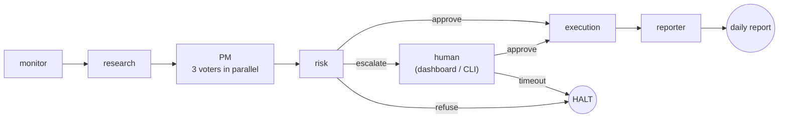

# AI Investment Firm

Multi-agent paper-trading firm. Take-home for Cato Networks — Agentic AI Engineer.

[](https://github.com/NoamDz/AI-Investment-Firm/actions/workflows/pr.yml)
[](https://github.com/NoamDz/AI-Investment-Firm/actions/workflows/main.yml)
[](https://github.com/NoamDz/AI-Investment-Firm/actions/workflows/release.yml)

A small AI-run trading desk: seven agents take turns each minute — research, three PM voters, risk, HITL, execution, reporter — and every claim that reaches the broker is backed by a verbatim quote from a real SEC filing. State, audit trail, and feedback loops (familiar-ticker routing, end-of-day reconciliation, reversal-rate metric) all live in one SQLite file, so a restart picks up exactly where it left off and yesterday's outcomes constrain today's sizing.

## Contents

- [Quickstart](#quickstart)
- [Architecture](#architecture)
- [Agents](#agents)
- [What was built](#what-was-built)
- [Sample runs](#sample-runs)
- [Documentation index](#documentation-index)

## Quickstart

### Prerequisites
- Python 3.11.x (3.13 ships without `torch.SymInt`; 3.10 lacks newer typing)
- Docker Desktop
- Anthropic API key (`ANTHROPIC_API_KEY`)
- *Optional:* CUDA GPU for faster corpus ingest

### Three commands

```powershell
copy .env.example .env                   # then set ANTHROPIC_API_KEY
docker compose up -d qdrant              # vector store
python -m firm.cli ingest                # one-time corpus embed (~2 min)
docker compose up firm                   # one heartbeat → BUY/HOLD → daily report
```

Full step-by-step (host venv, GPU notes, continuous loop + dashboard, HITL exercise, Alpaca): [`docs/quickstart.md`](docs/quickstart.md).

## Architecture

One heartbeat through the seven agents — risk is the only branch point; everything left of `execution` is a chance to stop a bad trade:



Deployment topology, per-node failure modes, data sources, and the AWS Bedrock AgentCore mapping: [`docs/architecture.md`](docs/architecture.md).

## Agents

| Agent | Role |
|---|---|
| **monitor** | Reads the clock and the universe each tick. Decides whether the market is open and which tickers are in scope. |
| **research** | Picks one candidate trade and writes its thesis as a list of *claims*, each backed by a verbatim quote from a real SEC filing. |
| **PM** | Three independent voters — *quality*, *valuation*, *catalyst* — debate the proposal in parallel. A majority is required to move the trade forward, so one bad day from one model can't carry a trade to the floor. |
| **risk** | Runs the rule book in plain Python — position limits, sector caps, daily loss, gross exposure. An LLM cannot argue past it. |
| **HITL** | Pauses the workflow when a trade is large enough to need a human signature and writes the request to an approval queue. The pause is real — the trade waits indefinitely; nobody answers in 30 minutes → auto-refused. |
| **execution** | Places the order with the broker. Every fill carries a unique nonce, so a network retry is safe. |
| **reporter** | Writes the day's report and refreshes the dashboard at end of run. |

Typed contracts, state lifecycle, and partial-failure model: [`docs/technical-overview.md`](docs/technical-overview.md).

## What was built

One subsection per Production Requirement in the brief, plus the two output channels §6 calls out.

### Persistent portfolio state
Everything important — cash, positions, cost basis, every decision, the human-approval queue, and the LangGraph workflow checkpoint — lives in one SQLite file (`data/firm.db`), streamed continuously to a backup target by Litestream. If the process dies mid-heartbeat, restart resumes from the same node, not from scratch. On boot, the firm reconciles its local positions against the broker (the broker is canonical); details in [`docs/technical-overview.md`](docs/technical-overview.md).

### RAG with citation discipline
Research never paraphrases. Qdrant pulls candidate passages from 84 FinanceBench 10-Ks via hybrid retrieval (BM25 + dense + re-ranker), the Anthropic Citations API returns the verbatim quote, and a cheaper sufficiency judge re-reads the passages and labels each claim *ok* / *partial* / *insufficient* — too many *insufficient* labels and the proposal is killed before PM ever sees it. Configuration in `config/rag.yaml`; deeper view in [`docs/architecture.md`](docs/architecture.md).

### Human-in-the-loop
The risk gate has three exits: approve, refuse, or escalate. On escalate, the graph saves a checkpoint and adds a signed row to the `hitl_queue`; the approver clicks approve/reject in the dashboard or runs `firm hitl ack <id>`, and the graph resumes from the same checkpoint. If the human edits the trade size, the new size goes back through the same risk check on the next tick — the human can't shortcut the rules, only the threshold for escalation.

### Observability
Every agent call, LLM call, tool call, and retrieval emits one OpenTelemetry span, written one line per span to `data/traces/<date>/run-<id>.jsonl`. To walk one trade end-to-end, grep the file by `decision_id` — the file *is* the audit log. The dashboard's *Trace* tab does the same walk in the browser, and the tracer ships to any OTLP backend (Honeycomb, Jaeger) in production by setting `OTEL_EXPORTER_OTLP_ENDPOINT`.

### Guardrails
Four layers, every failure named in one `FailureMode` enum (15 entries + `UNKNOWN`): **input validation** (`<system>`-marker scan → `PROMPT_INJECTION_DETECTED`), **output schema** (Pydantic on every agent boundary → `SCHEMA_VALIDATION_FAILED`), **hallucination** (the sufficiency judge above), and **trading limits** (the deterministic risk gate). A 51-case red-team suite proves each guardrail fires when it should and stays quiet when it shouldn't. Threat model: [`docs/threat_model.md`](docs/threat_model.md).

### Eval harness
`make eval` replays three historical 5-day windows with frozen clock, cached prices, and recorded LLM responses — no API key needed. Reports cover the **portfolio side** (per-trade returns FIFO-matched, hit rate, vs SPY, vs equal-weight basket) and the **process side** (groundedness ≥99.5%, decision discipline 100%, red-team 51/51, FailureMode coverage 14/14, sufficiency precision/recall ≥0.80, reversal rate ≤30%). Determinism is enforced in CI by running the eval twice and diffing the output. Full methodology: [`docs/eval.md`](docs/eval.md).

### Two output channels


*Tab 1 of the live dashboard on the 2024-03-13 earnings-day sample. Sibling captures: [2024-08-07 (drawdown)](sample_runs/2024-08-07/dashboard.png) · [2023-11-08 (quiet)](sample_runs/2023-11-08/dashboard.png).*

**Streamlit dashboard** is the live, in-browser delivery — *Today's Report*, *Live Desk* (5-second refresh), and *Trace* (`decision_id` → matching spans). **HTML bundle** is the durable handoff: one self-contained `daily_report.html` (no JS, no external assets) plus `positions.xlsx`, `decisions.jsonl`, and `trace.jsonl`. Both read the same `firm.db`, so they cannot disagree; both run on `docker compose up` with no SMTP, Slack, or S3.

## Sample runs

Three regimes committed for reviewer inspection — one trading day per regime, chosen *before* any prompt was tuned so they are not a fit:

| Date | Regime | What you can see |
|---|---|---|
| [`2024-03-13`](sample_runs/2024-03-13/README.md) | `r1_earnings` (signal-heavy) | A day during the NVDA/ORCL/ADBE earnings week — research has the most to chew on |
| [`2024-08-07`](sample_runs/2024-08-07/README.md) | `r2_drawdown` (risk gate stressed) | Mid sell-off — more REFUSE / ESCALATE outcomes |
| [`2023-11-08`](sample_runs/2023-11-08/README.md) | `r3_quiet` (negative control) | Low-vol day — the firm should *not* trade aggressively |

Each per-date directory has a narrated `README.md` (start there), `dashboard.png`, the HTML report bundle, and the raw `decisions.jsonl` + `trace.jsonl`. `scripts/hydrate_sample_db.py` rebuilds `firm.db` so a reviewer can re-render the bundle locally. Index: [`sample_runs/README.md`](sample_runs/README.md).

## Documentation index

| File | Purpose |
|------|---------|
| [`docs/quickstart.md`](docs/quickstart.md) | Full host + Docker setup, GPU notes, Alpaca, HITL exercise |
| [`docs/architecture.md`](docs/architecture.md) | Logical + deployment diagrams, data sources, where each safety net sits |
| [`docs/technical-overview.md`](docs/technical-overview.md) | Agent contracts, state lifecycle, partial-failure model, learning loops |
| [`docs/runbook.md`](docs/runbook.md) | Operator playbooks — approvals, restore, incidents |
| [`docs/eval.md`](docs/eval.md) | Eval methodology, regimes, process metrics, determinism gate |
| [`docs/threat_model.md`](docs/threat_model.md) | STRIDE + red-team corpus |
| [`docs/path-to-production.md`](docs/path-to-production.md) | Take-home → production delta map |
| [`docs/agentcore_mapping.md`](docs/agentcore_mapping.md) | Bedrock AgentCore mapping |
