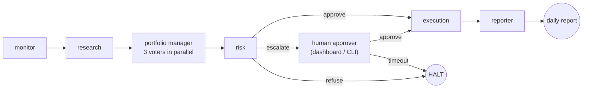
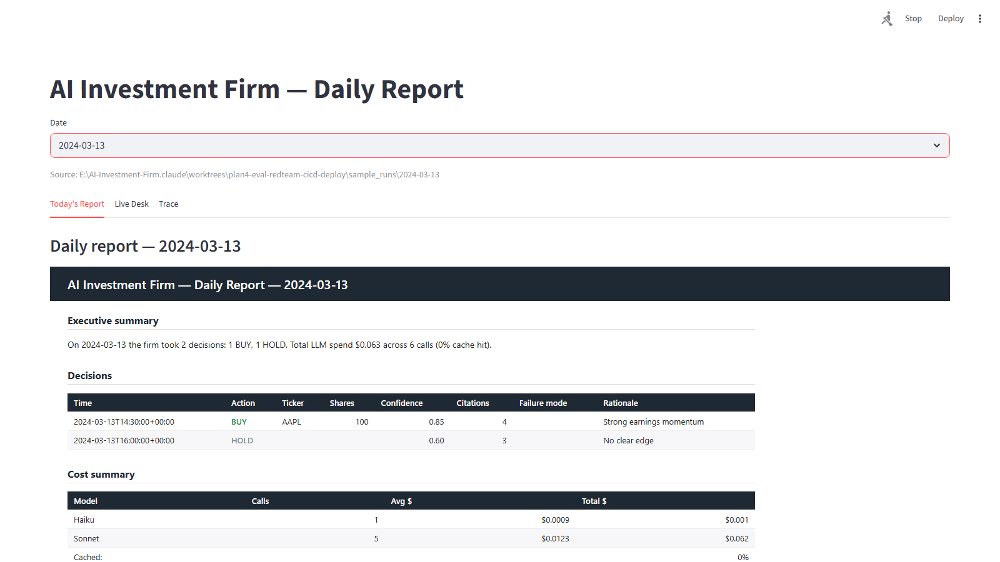

# AI Investment Firm

Multi-agent paper-trading firm. Take-home for Cato Networks — Agentic AI Engineer.

[](https://github.com/NoamDz/AI-Investment-Firm/actions/workflows/pr.yml)
[](https://github.com/NoamDz/AI-Investment-Firm/actions/workflows/main.yml)
[](https://github.com/NoamDz/AI-Investment-Firm/actions/workflows/release.yml)

A small AI-run trading desk: seven agents take turns each minute — research, three portfolio-manager voters, risk, a human approver, execution, reporter — and every claim that reaches the broker is backed by a verbatim quote from a real SEC filing. All state lives in one place that survives a crash, so a restart picks up exactly where it left off. Yesterday's outcomes constrain today's sizing automatically, and the firm flags its own mistakes the next morning.

## Contents

- [Quickstart](#quickstart)
- [Architecture](#architecture)
- [Agents](#agents)
- [What was built](#what-was-built)
- [Sample runs](#sample-runs)
- [Documentation index](#documentation-index)

## Quickstart

### Prerequisites
- Python 3.11.x (3.13 ships without `torch.SymInt`; 3.10 lacks newer typing)
- Docker Desktop
- Anthropic API key (`ANTHROPIC_API_KEY`)
- *Optional:* CUDA GPU for faster corpus ingest

### Three commands

```powershell
copy .env.example .env                   # then set ANTHROPIC_API_KEY
docker compose up -d qdrant              # vector store
python -m firm.cli ingest                # one-time corpus embed (~2 min)
docker compose up firm                   # one heartbeat → BUY/HOLD → daily report
```

Full step-by-step (host venv, GPU notes, continuous loop + dashboard, human-approval exercise, live broker): [`docs/quickstart.md`](docs/quickstart.md).

## Architecture

One heartbeat through the seven agents — the risk gate is the only branch point; everything to its left is a chance to stop a bad trade:



Deployment topology, per-node failure modes, data sources, and the AWS Bedrock AgentCore mapping: [`docs/architecture.md`](docs/architecture.md).

## Agents

| Agent | What it does |
|---|---|
| **monitor** | Reads the clock and the list of allowed stocks each tick. Decides whether the market is open and which names are in scope. |
| **research** | Picks one candidate stock to investigate and writes its thesis as a list of claims, each one backed by a verbatim quote from a real SEC filing. |
| **portfolio manager** | Three independent voters — quality, valuation, and catalyst — debate the proposal in parallel. A majority is required to move the trade forward, so one bad day from one model cannot carry a trade to the floor. |
| **risk** | Runs the rule book — position size limits, sector caps, daily loss limit, gross exposure. The rules are deterministic code, so the model cannot argue past them. |
| **human approver** | Pauses the workflow when a trade is large enough to need a human signature, and writes the request to an approval queue. The pause is real — the trade waits indefinitely; if nobody answers in 30 minutes it is auto-refused. |
| **execution** | Places the order with the broker. Every order carries a unique signature, so a network retry can never accidentally double-fill. |
| **reporter** | Writes the day's report and refreshes the dashboard at end of run. |

Typed contracts, state lifecycle, and partial-failure model: [`docs/technical-overview.md`](docs/technical-overview.md).

## What was built

One subsection per Production Requirement in the brief, plus the two output channels §6 calls out. Each describes *what* the firm does; *how* it does it is in the linked depth doc.

### Persistent portfolio state
All of the firm's important state — cash, holdings, every decision made, who owes an approval, and the half-finished workflow itself — is saved continuously, with a streaming backup to a separate location. If the process dies in the middle of a trade, restart resumes from the exact step it was on; no model calls are re-issued and no work is re-done. On boot, the firm asks the broker what positions and cash it actually holds and corrects any drift before the next tick.

### RAG with citation discipline
Research never paraphrases. Before any claim reaches the portfolio managers, candidate passages are pulled from a corpus of real SEC 10-K filings, the model is forced to attach the verbatim quote, and a separate cheaper reader re-reads those passages and labels each claim trustworthy, partial, or unsupported. Too many unsupported labels and the proposal is killed before it ever reaches the floor.

### Human-in-the-loop
The risk gate has three exits: approve, refuse, or escalate. On escalate, the workflow pauses and a signed request lands in the approval queue; the approver clicks approve or reject from the dashboard or the CLI, and the workflow resumes from exactly the same point. If the human edits the trade size, the new size still has to clear the rule book on the next tick — the human can shortcut the threshold for escalation, not the rules themselves.

### Observability
Every step the firm takes — every agent run, every model call, every retrieval, every order — emits one structured trace line to a per-day log file. To walk one trade end-to-end, filter that file by the trade's ID; the file *is* the audit log. The dashboard does the same walk in the browser, and in production the same stream ships to any standard observability backend.

### Guardrails
Four layers protect the firm from itself and from bad inputs: filtered text rejects prompt-injection attempts hidden in retrieved web or filing content; every agent's output is shape-checked before being trusted downstream; the citation re-reader catches hallucinations before they reach the portfolio managers; and the rule book enforces trading limits the model cannot argue past. A red-team suite of 51 adversarial cases proves each layer fires when it should and stays quiet when it shouldn't.

### Eval harness
Three historical 5-day market windows replay end-to-end with frozen clock and recorded model responses — no API key required, runs in CI. Reports cover both **portfolio performance** (per-trade returns, hit rate, vs. S&P 500, vs. an equal-weight basket of the universe) and **process quality** (groundedness, decision discipline, guardrail effectiveness, mistake rate). Determinism is enforced by running the eval twice and diffing the output; any leaking randomness fails the build. Run with `make eval`; the per-regime numbers land at `reports/eval/<regime>/summary.md` — see [`docs/eval.md`](docs/eval.md) for the report shape and metric definitions.

### Two output channels



*The live dashboard on the 2024-03-13 sample. Sibling captures: [2024-08-07 (sell-off)](sample_runs/2024-08-07/dashboard.png) · [2023-11-08 (quiet)](sample_runs/2023-11-08/dashboard.png).*

Two complementary delivery channels — both running on `docker compose up` with no external infrastructure (no Slack workspace, no SMTP server, no cloud bucket) required:

- **Channel A — Live web dashboard.** Open in a browser at the local URL. Three tabs: *Today's Report* shows the rendered daily report for any selected date; *Live Desk* refreshes every few seconds and shows current cash, positions, recent decisions, the human-approval queue, today's spend, and reconciliation; *Trace* takes a decision ID and shows every step that trade went through.
- **Channel B — Self-contained report bundle.** Written to disk at end of day. One HTML file (no JavaScript, no external assets — opens cleanly off a USB stick), one Excel workbook (positions with mark-to-market unrealized P&L; one row per decision with action, ticker, citation count, rationale), and the raw decision and trace logs as plain JSONL. Per-trade *realized* P&L plus benchmarks vs. S&P and the universe basket live in the eval report (`reports/eval/<regime>/summary.md`), not in the daily bundle.

Why both: real-time vs. durable, different audiences (operators vs. forwardable stakeholders). Both read the same underlying state, so they cannot disagree.

## Sample runs

Three committed trading days, one per market regime. Each was chosen *before* any prompt was tuned, so they are not a fit. With the default configuration the firm investigates **AMD** as its first candidate each tick — AMD is the one entry in the universe whose ticker matches its filing-corpus company name verbatim, so retrieval returns real chunks out of the box.

| Date | Regime | Tickers in the bundle | What happened |
|---|---|---|---|
| [`2024-03-13`](sample_runs/2024-03-13/README.md) | Earnings week (NVDA, ORCL, ADBE report) | AAPL | High-confidence BUY on AAPL backed by four citations, then an afternoon HOLD when the model couldn't find a fresh edge |
| [`2024-08-07`](sample_runs/2024-08-07/README.md) | Post-Aug-5 sell-off | NVDA | De-risking SELL on NVDA, then a portfolio-level hedge proposal that exceeded the per-trade limit and was escalated to the human approver |
| [`2023-11-08`](sample_runs/2023-11-08/README.md) | Quiet pre-CPI tape | — | Two HOLD decisions — quiet day, no fresh catalysts, the firm correctly does nothing |

Each per-date folder has a narrated `README.md` (start there), a dashboard screenshot, the HTML report bundle, the Excel workbook, and the raw decision and trace logs. A small script (`scripts/hydrate_sample_db.py`) rebuilds the firm's state file so a reviewer can re-render any bundle locally.

## Documentation index

| File | Purpose |
|------|---------|
| [`docs/quickstart.md`](docs/quickstart.md) | Full host + Docker setup, GPU notes, live broker, human-approval exercise |
| [`docs/architecture.md`](docs/architecture.md) | Logical + deployment diagrams, data sources, where each safety net sits |
| [`docs/technical-overview.md`](docs/technical-overview.md) | Agent contracts, state lifecycle, partial-failure model, learning loops |
| [`docs/runbook.md`](docs/runbook.md) | Operator playbooks — approvals, restore, incidents |
| [`docs/eval.md`](docs/eval.md) | Eval methodology, regimes, process metrics, determinism gate |
| [`docs/threat_model.md`](docs/threat_model.md) | STRIDE + red-team corpus |
| [`docs/path-to-production.md`](docs/path-to-production.md) | Take-home → production delta map |
| [`docs/agentcore_mapping.md`](docs/agentcore_mapping.md) | Bedrock AgentCore mapping |
