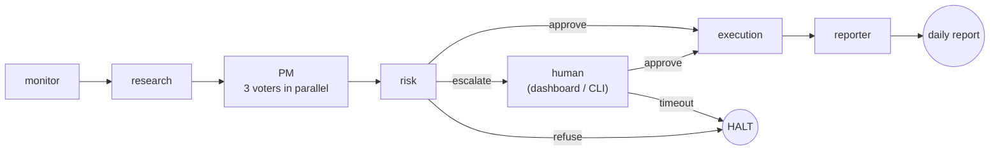

# AI Investment Firm

Multi-agent paper-trading firm. Take-home for Cato Networks — Agentic AI Engineer.

[](https://github.com/NoamDz/AI-Investment-Firm/actions/workflows/pr.yml)
[](https://github.com/NoamDz/AI-Investment-Firm/actions/workflows/main.yml)
[](https://github.com/NoamDz/AI-Investment-Firm/actions/workflows/release.yml)

## Overview

A small AI-run trading desk. Seven agents take turns each minute: read the market, pick a trade, debate it, check the rules, ask a human if the trade is large, place the order with a paper broker, and write the day's report. All state lives in one SQLite file, so the desk picks up exactly where it left off after a restart.

The interesting part is the back-and-forth. A trade only reaches the broker after research has quoted a real SEC filing, a separate reader has agreed the quotes actually support the claims, three independent voters have agreed it's worth doing, a plain-Python rule book has cleared every limit, and (for big trades) a human has approved it from the dashboard or the CLI.

## Architecture

One heartbeat through the seven agents:



Risk is the only branch point. Everything left of `execution` is a chance to stop a bad trade.

Deeper view (deployment topology, where each safety net sits): [`docs/architecture.md`](docs/architecture.md).

## Prerequisites

- Python 3.11.x (3.13 ships without `torch.SymInt`; 3.10 lacks newer typing)
- Docker Desktop
- Anthropic API key (`ANTHROPIC_API_KEY`)
- *Optional:* CUDA GPU for faster corpus ingest

## Quickstart

```powershell
copy .env.example .env                   # then set ANTHROPIC_API_KEY
docker compose up -d qdrant              # vector store
python -m firm.cli ingest                # one-time corpus embed (~2 min)
docker compose up firm                   # one heartbeat → REFUSE or BUY → daily report
```

Continuous demo (two terminals):

```powershell
# Terminal 1 — the firm loop
python -m firm.cli run --loop --interval-seconds 60     # Ctrl-C to stop

# Terminal 2 — the live dashboard
pip install -e ".[dashboard]"
streamlit run firm/dashboard.py                          # http://localhost:8501
```

Full step-by-step (host venv, GPU notes, HITL exercise, Alpaca, native run): [`docs/quickstart.md`](docs/quickstart.md).

## What was built

This is the reviewer's map of the brief. Each item below maps to one line in the assignment's *The Goal* or *Production Requirements* lists, with a pointer to the depth doc.

### The portfolio is real-shaped

Fills go through a paper broker that charges **5 bps slippage** and a **per-share commission**, so a buy at $100 settles at $100.05 plus fees (`firm/broker/fake_broker.py`). Quotes carry a market-clock timestamp; an order priced from a stale quote (older than 60 s) is refused. Real broker (Alpaca) is a one-flag swap via `FIRM_BROKER=ALPACA`.

### State survives a crash

Cash, positions, cost basis, every decision, the cost ledger, the human-approval queue, and the LangGraph snapshot all live in one file: `data/firm.db`. A crash mid-trade resumes mid-trade from the same source the broker reconciles against at boot. Litestream replicates the file to a backup target for restore. Operator detail: [`docs/runbook.md`](docs/runbook.md).

### Runs continuously during market hours

`python -m firm.cli run --loop` ticks once a minute and ignores ticks outside US market hours (`firm/agents/monitor.py`). Each tick is one self-contained heartbeat — if any single tick fails, the next one still fires.

### Seven agents, real collaboration

Each agent does one job and hands off to the next:

1. **monitor** — reads the clock and the list of allowed tickers.
2. **research** — picks one candidate trade and writes its thesis as a list of *claims*. Every claim must quote a passage from a real filing.
3. **PM** — *not* a single model. Three voters run in parallel:
   - **quality** ("is this a good business?")
   - **valuation** ("is the price reasonable?")
   - **catalyst** ("is there a near-term reason to act?")

   Each one votes BUY / HOLD / VETO independently. A majority is required to move the trade forward. One bad day from one model can't carry a trade to the floor.
4. **risk** — runs the rule book in plain Python: max **10%** in one name, **30%** per sector, gross book ≤ **100%** of capital, daily loss ≤ **3%**. An LLM cannot argue past it.
5. **HITL (human-in-the-loop)** — pauses the workflow and writes a signed entry to the approval queue. The approver sees it in the **dashboard** (or runs `firm hitl ack <id>` from the CLI) and clicks approve / reject. The pause is real — you can stop the process, walk away, come back tomorrow, and the trade is still waiting. Nobody answers in 30 minutes → the trade is auto-refused. Slack is supported as an optional notifier but not required.
6. **execution** — places the order with the broker. The same order can't fill twice — every fill carries a unique nonce, so a network retry is safe.
7. **reporter** — writes the day's Markdown report and refreshes the dashboard.

Typed contracts, state lifecycle, and partial-failure model: [`docs/technical-overview.md`](docs/technical-overview.md).

### Every claim is grounded in a real filing

Research never paraphrases. Qdrant pulls candidate passages from an index of SEC 10-Ks (keyword + dense embedding + a re-ranker for ordering); the Anthropic Citations API returns the exact verbatim quote, which is stored on the claim. A separate, cheaper reader (Haiku) re-reads the same passages and labels each claim *ok*, *partial*, or *insufficient*. Too many *insufficient* labels and the whole proposal is killed before the PM ever sees it. Corpus: 84 10-Ks from the FinanceBench dataset. Config: `config/rag.yaml`.

### Human-in-the-loop for big trades

The risk gate has three exits: *approve* (→ execution), *refuse* (heartbeat ends), or *escalate* (→ human). On escalate, the graph saves a checkpoint and adds a signed row to the `hitl_queue` table. The approver acts on it from the dashboard or via `firm hitl ack <id>` — both write back to the same queue. When the row flips to `approved`, the graph resumes from the same checkpoint. If the human *edits* the size, the new size goes back through the same risk check on the next tick — the human can't shortcut the rules, only the threshold for escalation.

### Observability — replay any trade from the trace

Every agent call, every LLM call, every tool call, and every retrieval emits one OpenTelemetry span, written one-per-line to `data/traces/<date>/run-<id>.jsonl`. Each span carries:

- `name` — which agent or tool ran (`agent.research`, `llm.anthropic`, `retrieve.qdrant`, …)
- `decision_id` — the trade being decided
- `parent_id` — which span called this one (research → vote → risk → fill chain)
- `attributes.model`, `attributes.tokens_in`, `attributes.tokens_out`, `attributes.cost_usd`
- `attributes.failure_mode` if the call failed (one of the 15 named failures)
- `start_time_unix_nano`, `duration_ms`

To replay one trade end-to-end with no tooling:

```bash
grep '"decision_id":"<id>"' data/traces/2024-03-13/run-*.jsonl | jq .name
```

That prints the whole heartbeat in order: monitor → research → sufficiency → 3 PM voters → risk → execution → reporter. The file *is* the audit log. The same tracer ships to a real OTLP backend in production by setting `OTEL_EXPORTER_OTLP_ENDPOINT`.

### Two report channels, one source of truth

Both read `data/firm.db`, so they cannot disagree.

- **Streamlit dashboard** — live positions, recent decisions, the human-approval queue, today's spend, reconciliation status. Auto-refreshes every 5 s.
- **Daily report bundle** — written by the reporter at end-of-day: `daily_report.md` (decision counts, cost summary, reconciliation), `positions.xlsx` (operator spreadsheet), `decisions.jsonl` (audit log), `trace.jsonl` (OpenTelemetry stream).

Why both: operators who pivot in Excel get the spreadsheet; reviewers who want a live view get the dashboard. Two mediums for two audiences, one database underneath.


### Reproducible eval — return + process metrics

`make eval` (or `python -m firm.cli eval --regime all --mode cached`) replays three historical 5-day windows with frozen clock, cached prices, and recorded LLM responses. **No API key needed.** It writes per-regime markdown to `reports/eval/<regime_id>/summary.md` plus daily report bundles under each date.

The three regimes (declared in `firm/eval/regimes.py:91-116` *before* any prompt was tuned, so this is not a fit):

| ID | Window | Character | Why included |
|---|---|---|---|
| `r1_earnings` | 2024-03-11 → 03-15 | NVDA, ORCL, ADBE all report | Most signal for the research and PM agents |
| `r2_drawdown` | 2024-08-05 → 08-09 | Post-Aug-5 sell-off | Stresses the risk gate and human-approval path |
| `r3_quiet` | 2023-11-06 → 11-10 | Low-volatility quiet | Negative control — the firm should *not* trade aggressively |

What the report contains:

- **Portfolio side** — per-trade returns (FIFO-matched, commission folded in), hit rate (with `n=...` caveat), total return vs SPY, total return vs an equal-weight basket of the universe.
- **Process side** — ten measurements (groundedness ≥99.5%, decision discipline 100%, red-team pass 51/51, risk-policy compliance 0 breaches at broker, HITL correctness 100%, FailureMode coverage 14/14, sufficiency precision/recall ≥0.80, reversal rate ≤30%, citation diversity, schema rejections). These are the load-bearing numbers — performance vs SPY is reported because the brief asks for it, but at N≈15 trades total it's noise, and the report says so in a mandatory "Not Measured" block.

Reproducibility is enforced by `firm/ops/check_reports_clean.sh` — it runs the eval twice and diffs the output. Any leaking randomness exits non-zero in CI. Full methodology, what each metric measures, and what's deliberately *not* measured: [`docs/eval.md`](docs/eval.md).

### Guardrails — every input, output, and trade limit

- **Input validation** — retrieved web/filing text is scanned for `<system>`-style markers; a hit becomes `PROMPT_INJECTION_DETECTED` and is refused.
- **Output schema** — every agent's output is validated by Pydantic on the way out; malformed JSON or a missing field becomes `SCHEMA_VALIDATION_FAILED`.
- **Hallucination** — the sufficiency judge described above.
- **Trading limits** — the deterministic risk gate; an LLM cannot bypass it.

Every failure has a name. There are **15 in a `FailureMode` enum** with a catch-all `UNKNOWN`, and each one has a coverage test in `tests/integration/`. On top of that, a **51-case red-team suite** (citation forgery, role hijack, confused-deputy, unicode homoglyphs, spoofed approvals, multi-step chains) proves each guardrail fires when it should — and stays quiet when it shouldn't. Full threat model: [`docs/threat_model.md`](docs/threat_model.md).

### Improving from past decisions

The firm doesn't update model weights at runtime — but every heartbeat reads what previous heartbeats decided, and several loops are closed automatically:

- **The risk gate stands on prior outcomes.** Current positions are the residue of every past trade. The 10%-per-name and 30%-per-sector limits are checked against those positions every tick, so yesterday's BUY automatically constrains today's sizing.
- **Research recognises familiar tickers.** Before each retrieval, research scans the `decisions` table for any prior trade on the same ticker (`firm/agents/research.py:186`). A novel ticker bumps the router to the stronger model (Sonnet) because there is no prior context to lean on; a familiar one stays on Haiku.
- **End-of-day reconciliation surfaces drift.** The reporter diffs local positions against the broker and writes the result to `reconciliations`. A mismatch is visible the next morning in the dashboard and blocks the next tick until acked.
- **The reversal-rate metric measures real mistakes.** The eval harness asks: of trades that opened in the last 5-day window, what percentage closed at a loss within 3 days? Threshold ≤30%. A rising number is the firm telling on itself.
- **Audit trail is the substrate for prompt iteration.** Every decision, every retrieval hit, every LLM call is on disk (the `decisions` table + the trace JSONL). An operator scanning a week of REFUSE outcomes by `failure_mode` can pinpoint whether the sufficiency judge is too strict, the citations are too weak, or a prompt needs work — then re-record cassettes and re-run the determinism gate.

What the system deliberately does **not** do: re-tune prompts at runtime, run a nightly reflection LLM over its own decisions, or update weights. Those are the next layer of work, called out in [`docs/path-to-production.md`](docs/path-to-production.md).

### Where the data comes from

| What the firm reads | Source | When |
|---|---|---|
| **SEC 10-Ks** (research grounding) | 84 filings from the **FinanceBench** dataset (`PatronusAI/financebench` on Hugging Face). Loaded once at `firm.cli ingest` time, chunked, embedded, and stored in Qdrant. The 150 Q&A holdout pairs (`config/financebench_eval_holdout.json`) are excluded from ingest so they stay unseen. | One-time |
| **Historical adjusted close prices** (eval benchmarks) | `yfinance` pulls once and caches each ticker as parquet at `data/eval/prices/<TICKER>.parquet`. Eval runs in `replay` mode and never touches the network; a missing parquet is a hard error. | One-time per ticker, cached after first hit |
| **Quotes during a live run** | `firm/broker/fake_broker.py` — quote price is a deterministic function of `SHA256(ticker, market timestamp)`, so the same heartbeat produces the same number every replay. Swap to Alpaca live quotes with `FIRM_BROKER=ALPACA`. | Every heartbeat |
| **LLM responses** (eval and CI) | Anthropic API responses are recorded under `tests/_fixtures/cassettes/` keyed by `SHA256(model, system, messages, tools)`. `FIRM_LLM_MODE=cached` replays only; a cache miss is a hard error. This is what makes the eval byte-identical with no API key. | First record from live API, then replayed forever |

Deeper retrieval-pipeline detail (chunking, hybrid search, re-rank): [`docs/architecture.md`](docs/architecture.md) and `config/rag.yaml`.

### Sample run committed

The three windows the eval replays are checked into `sample_runs/` as snapshots, one trading day per regime:

| Date | Regime | What you can see |
|---|---|---|
| `sample_runs/2024-03-13/` | `r1_earnings` (signal-heavy) | A day during the NVDA/ORCL/ADBE earnings week — research has the most to chew on |
| `sample_runs/2024-08-07/` | `r2_drawdown` (risk gate stressed) | Mid sell-off — expect more REFUSE / ESCALATE outcomes |
| `sample_runs/2023-11-08/` | `r3_quiet` (negative control) | Low-vol day — the firm should *not* trade aggressively |

Each directory contains:

- `daily_report.md` — what the reporter wrote at end-of-day (decision counts, cost summary, EOD reconciliation)
- `decisions.jsonl` — full audit log, one decision per line
- `trace.jsonl` — the OpenTelemetry stream described in the Observability section
- `positions.xlsx` — the operator spreadsheet

Open `daily_report.md` for the human-readable summary; `grep` `trace.jsonl` by `decision_id` to walk one trade end-to-end. The methodology behind which dates and why is in [`docs/eval.md`](docs/eval.md).

### Bonuses

- **AWS Bedrock AgentCore mapping** — every box in the deployment view has a one-to-one mapping to an AgentCore primitive: [`docs/agentcore_mapping.md`](docs/agentcore_mapping.md).
- **IaC** — Terraform with six modules; the deployment diagram in `docs/architecture.md` is what these modules build.
- **CI/CD** — three GitHub workflows (`pr.yml`, `main.yml`, `release.yml`); badges above.
- **Advanced RAG** — hybrid retrieval (BM25 + dense + re-ranker) with a contextual-augment pass at index time.
- **Cost-aware model routing** — every LLM call picks Haiku first and falls through to Sonnet on overload; a content-addressed prompt cache means the same prompt is never billed twice; each call writes one row to `cost_ledger`.
- **Prompt-injection defenses** — input sanitizer + sufficiency judge + the red-team corpus.

## Documentation index

| File | Purpose |
|------|---------|
| [`docs/quickstart.md`](docs/quickstart.md) | Full host + Docker setup, GPU notes, Alpaca, HITL exercise |
| [`docs/architecture.md`](docs/architecture.md) | Logical + deployment diagrams, where each safety net sits |
| [`docs/technical-overview.md`](docs/technical-overview.md) | Agent contracts, state lifecycle, partial-failure model |
| [`docs/runbook.md`](docs/runbook.md) | Operator playbooks — approvals, restore, incidents |
| [`docs/eval.md`](docs/eval.md) | Eval methodology, regimes, process metrics, determinism gate |
| [`docs/threat_model.md`](docs/threat_model.md) | STRIDE + red-team corpus |
| [`docs/path-to-production.md`](docs/path-to-production.md) | Take-home → production delta map |
| [`docs/agentcore_mapping.md`](docs/agentcore_mapping.md) | Bedrock AgentCore mapping |
