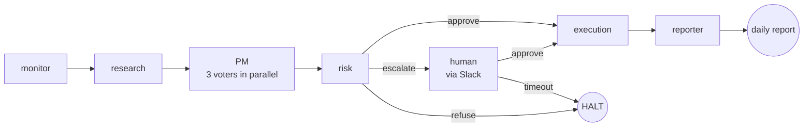

# AI Investment Firm

Multi-agent paper-trading firm. Take-home for Cato Networks — Agentic AI Engineer.

[](https://github.com/NoamDz/AI-Investment-Firm/actions/workflows/pr.yml)
[](https://github.com/NoamDz/AI-Investment-Firm/actions/workflows/main.yml)
[](https://github.com/NoamDz/AI-Investment-Firm/actions/workflows/release.yml)

## Overview

A small AI-run trading desk. Seven agents take turns each minute: read the market, pick a trade, debate it, check the rules, ask a human if the trade is large, place the order with a paper broker, and write the day's report. All state lives in one SQLite file, so the desk picks up exactly where it left off after a restart.

The interesting part is the back-and-forth. A trade only reaches the broker after research has quoted a real SEC filing, a separate reader has agreed the quotes actually support the claims, three independent voters have agreed it's worth doing, a plain-Python rule book has cleared every limit, and (for big trades) a human has approved it in Slack.

## Architecture

One heartbeat through the seven agents:



Risk is the only branch point. Everything left of `execution` is a chance to stop a bad trade.

Deeper view (deployment topology, where each safety net sits): [`docs/architecture.md`](docs/architecture.md).

## Prerequisites

- Python 3.11.x (3.13 ships without `torch.SymInt`; 3.10 lacks newer typing)
- Docker Desktop
- Anthropic API key (`ANTHROPIC_API_KEY`)
- *Optional:* CUDA GPU for faster corpus ingest

## Quickstart

```powershell
copy .env.example .env                   # then set ANTHROPIC_API_KEY
docker compose up -d qdrant              # vector store
python -m firm.cli ingest                # one-time corpus embed (~2 min)
docker compose up firm                   # one heartbeat → REFUSE or BUY → daily report
```

Continuous demo (two terminals):

```powershell
# Terminal 1 — the firm loop
python -m firm.cli run --loop --interval-seconds 60     # Ctrl-C to stop

# Terminal 2 — the live dashboard
pip install -e ".[dashboard]"
streamlit run firm/dashboard.py                          # http://localhost:8501
```

Full step-by-step (host venv, GPU notes, HITL exercise, Alpaca, native run): [`docs/quickstart.md`](docs/quickstart.md).

## What was built

This is the reviewer's map of the brief. Each item below maps to one line in the assignment's *The Goal* or *Production Requirements* lists, with a pointer to the depth doc.

### The portfolio is real-shaped

Fills go through a paper broker that charges **5 bps slippage** and a **per-share commission**, so a buy at $100 settles at $100.05 plus fees (`firm/broker/fake_broker.py`). Quotes carry a market-clock timestamp; an order priced from a stale quote (older than 60 s) is refused. Real broker (Alpaca) is a one-flag swap via `FIRM_BROKER=ALPACA`.

### State survives a crash

Cash, positions, cost basis, every decision, the cost ledger, the human-approval queue, and the LangGraph snapshot all live in one file: `data/firm.db`. A crash mid-trade resumes mid-trade from the same source the broker reconciles against at boot. Litestream replicates the file to a backup target for restore. Operator detail: [`docs/runbook.md`](docs/runbook.md).

### Runs continuously during market hours

`python -m firm.cli run --loop` ticks once a minute and ignores ticks outside US market hours (`firm/agents/monitor.py`). Each tick is one self-contained heartbeat — if any single tick fails, the next one still fires.

### Seven agents, real collaboration

Each agent does one job and hands off to the next:

1. **monitor** — reads the clock and the list of allowed tickers.
2. **research** — picks one candidate trade and writes its thesis as a list of *claims*. Every claim must quote a passage from a real filing.
3. **PM** — *not* a single model. Three voters run in parallel:
   - **quality** ("is this a good business?")
   - **valuation** ("is the price reasonable?")
   - **catalyst** ("is there a near-term reason to act?")

   Each one votes BUY / HOLD / VETO independently. A majority is required to move the trade forward. One bad day from one model can't carry a trade to the floor.
4. **risk** — runs the rule book in plain Python: max **10%** in one name, **30%** per sector, gross book ≤ **100%** of capital, daily loss ≤ **3%**. An LLM cannot argue past it.
5. **HITL (human-in-the-loop)** — pauses the workflow and posts a signed Slack message ("approve / edit / reject?"). The pause is real — you can stop the process, walk away, come back tomorrow, and the trade is still waiting. Nobody answers in 30 minutes → the trade is auto-refused.
6. **execution** — places the order with the broker. The same order can't fill twice — every fill carries a unique nonce, so a network retry is safe.
7. **reporter** — writes the day's Markdown report and refreshes the dashboard.

Typed contracts, state lifecycle, and partial-failure model: [`docs/technical-overview.md`](docs/technical-overview.md).

### Every claim is grounded in a real filing

Research never paraphrases. Qdrant pulls candidate passages from an index of SEC 10-Ks (keyword + dense embedding + a re-ranker for ordering); the Anthropic Citations API returns the exact verbatim quote, which is stored on the claim. A separate, cheaper reader (Haiku) re-reads the same passages and labels each claim *ok*, *partial*, or *insufficient*. Too many *insufficient* labels and the whole proposal is killed before the PM ever sees it. Corpus: 84 10-Ks from the FinanceBench dataset. Config: `config/rag.yaml`.

### Human-in-the-loop for big trades

The risk gate has three exits: *approve* (→ execution), *refuse* (heartbeat ends), or *escalate* (→ human). On escalate, the graph saves a checkpoint and posts to Slack. When the human approves, the graph resumes from the same checkpoint. If the human *edits* the size, the new size goes back through the same risk check on the next tick — the human can't shortcut the rules, only the threshold for escalation.

### Replay any trade from the trace

Every agent call, every LLM call, every tool call, and every retrieval writes one line to `data/traces/<date>/run-<id>.jsonl`. Each line carries the decision ID, the parent decision, the failure mode (if any), the model used, tokens, and cost. `grep` one decision ID and you have the whole heartbeat — research → vote → risk check → fill — without standing up any monitoring stack. The same tracer ships to a real OTLP backend in production.

### Two report channels, one source of truth

Both read `data/firm.db`, so they cannot disagree.

- **Streamlit dashboard** — live positions, recent decisions, the human-approval queue, today's spend, reconciliation status. Auto-refreshes.
- **Daily `positions.xlsx`** — written by the reporter at end-of-day.

Why both: operators who pivot in Excel get a spreadsheet; reviewers who want a live view get the dashboard. Two mediums for two audiences, one database underneath.

### Reproducible eval — return + process metrics

`make eval` replays three historical regimes (a bull month, a chop month, a stress month) from recorded prices and recorded LLM responses; no API key needed in cached mode. It reports both **portfolio performance vs. SPY** *and* **process-quality metrics**: groundedness rate, citation coverage, refusal rate, guardrail-fire rate, cost per decision. Byte-identical run-to-run — `scripts/check_reports_clean.sh` runs the eval twice and diffs the output; any leaking randomness breaks CI. Methodology and what's deliberately *not* measured: [`docs/eval.md`](docs/eval.md).

### Guardrails — every input, output, and trade limit

- **Input validation** — retrieved web/filing text is scanned for `<system>`-style markers; a hit becomes `PROMPT_INJECTION_DETECTED` and is refused.
- **Output schema** — every agent's output is validated by Pydantic on the way out; malformed JSON or a missing field becomes `SCHEMA_VALIDATION_FAILED`.
- **Hallucination** — the sufficiency judge described above.
- **Trading limits** — the deterministic risk gate; an LLM cannot bypass it.

Every failure has a name. There are **15 in a `FailureMode` enum** with a catch-all `UNKNOWN`, and each one has a coverage test in `tests/integration/`. On top of that, a **51-case red-team suite** (citation forgery, role hijack, confused-deputy, unicode homoglyphs, spoofed approvals, multi-step chains) proves each guardrail fires when it should — and stays quiet when it shouldn't. Full threat model: [`docs/threat_model.md`](docs/threat_model.md).

### Production-shaped thinking

- **Token cost** — every LLM call goes through a cost router that picks the cheapest model that can do the job (Haiku first, fall through to Sonnet on overload). A content-addressed prompt cache means the same prompt is never billed twice. A `cost_ledger` row records the spend per decision.
- **Scalability** — heartbeats are stateless between ticks; horizontal scale is N firm processes against shared Postgres (RDS in the Terraform), each owning a thread id.
- **High availability** — Litestream replication of `firm.db`, an idle reaper that auto-refuses stale human approvals, crash-resumes from the LangGraph checkpoint.
- **Standardization** — Terraform under `infra/terraform/` (network, compute, storage, secrets, observability, bedrock modules); CI on every PR (lint + types + tests + docker build + eval-clean diff). Take-home → prod delta: [`docs/path-to-production.md`](docs/path-to-production.md).

### Sample run committed

Three full historical days are checked into `sample_runs/` (2023-11-08, 2024-03-13, 2024-08-07), each with `daily_report.md`, `decisions.jsonl`, `trace.jsonl`, and `positions.xlsx`. Open one to see exactly what a reviewer would see at end-of-day.

### Bonuses

- **AWS Bedrock AgentCore mapping** — every box in the deployment view has a one-to-one mapping to an AgentCore primitive: [`docs/agentcore_mapping.md`](docs/agentcore_mapping.md).
- **IaC** — Terraform with six modules; the deployment diagram in `docs/architecture.md` is what these modules build.
- **CI/CD** — three GitHub workflows (`pr.yml`, `main.yml`, `release.yml`); badges above.
- **Advanced RAG** — hybrid retrieval (BM25 + dense + re-ranker) with a contextual-augment pass at index time.
- **Cost-aware model routing** — the router described above.
- **Prompt-injection defenses** — input sanitizer + sufficiency judge + the red-team corpus.

## Status

- [x] Plan 1: Foundation + Walking Skeleton
- [x] Plan 2: RAG + Citations + Grounding
- [x] Plan 3: HITL + Daily Reports + Observability
- [x] Plan 4: Eval Harness + Red Team + CI/CD + Bonuses

## Documentation index

| File | Purpose |
|------|---------|
| [`docs/quickstart.md`](docs/quickstart.md) | Full host + Docker setup, GPU notes, Alpaca, Slack exercise |
| [`docs/architecture.md`](docs/architecture.md) | Logical + deployment diagrams, where each safety net sits |
| [`docs/technical-overview.md`](docs/technical-overview.md) | Agent contracts, state lifecycle, partial-failure model |
| [`docs/runbook.md`](docs/runbook.md) | Operator playbooks — approvals, restore, incidents |
| [`docs/eval.md`](docs/eval.md) | Eval methodology, regimes, process metrics |
| [`docs/threat_model.md`](docs/threat_model.md) | STRIDE + red-team corpus |
| [`docs/path-to-production.md`](docs/path-to-production.md) | Take-home → production delta map |
| [`docs/agentcore_mapping.md`](docs/agentcore_mapping.md) | Bedrock AgentCore mapping |
