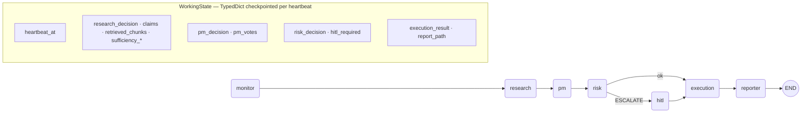
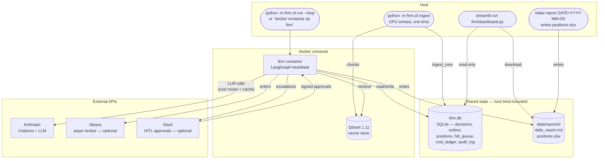

# Architecture

Two views: **logical** (the one heartbeat the LangGraph orchestrates) and **deployment** (the host + container topology the demo runs on).

## Logical — one heartbeat through seven nodes

`firm/orchestrator/graph.py:35` wires the edges. Conditional after risk: `route_after_risk` reads `risk_decision.action`; `ESCALATE` routes to `hitl` (interrupted by `interrupt_before=["hitl"]`) and waits for `make dev-ack` or a Slack approval. All other actions fall straight to `execution`.

State is persisted by a `SqliteSaver` (LangGraph checkpointer) into `firm.db` under thread id `heartbeat_at`. An interrupt resumes from the saved checkpoint on the next `--loop` tick rather than restarting the heartbeat.

### Where the safety nets sit

| Node | Defends against | Mechanism |
|------|-----------------|-----------|
| `research` | Hallucinated evidence | Anthropic Citations API → Qdrant (BM25 + Nomic + BGE rerank) → Haiku sufficiency judge re-reads the same passages; rejects with typed `INSUFFICIENT_EVIDENCE` / `UNCITED_CLAIM` |
| `pm` | Single-LLM groupthink | LangGraph `Send` fans out **three lenses in parallel** (quality / valuation / catalyst); majority vote required |
| `risk` | Silent policy bypass | Deterministic gates — gross & net exposure, per-name & per-sector caps, drawdown, quote-age. ESCALATE → HITL |
| `hitl` | Unsigned approvals | HMAC-SHA256 dual-key rotation (`firm/hitl/signing.py`); stale items reaped as `UNAPPROVED_HIGH_RISK` |
| `execution` | Duplicate fills | Idempotency keyed by HMAC nonce; chained `parent_id` in audit log |
| `reporter` | Drift between channels | Reads `firm.db` only; both dashboard and xlsx pull from the same source |

## Deployment — host + Docker

### Why this split

- **GPU ingest stays on the host.** Embedding 84 10-Ks with Nomic + BGE rerank wants CUDA; the firm runtime itself is CPU-bound and runs anywhere Docker does.
- **Qdrant in Docker, pinned to 1.11.** `qdrant-client` is bounded to `>=1.11,<1.13` in `pyproject.toml` so the wire format never drifts under us.
- **`firm.db` is the single source of truth.** The dashboard and the xlsx report read from it; they cannot disagree.
- **External APIs are optional.** Alpaca is gated by `FIRM_BROKER=ALPACA` (default `FAKE`); Slack by `FIRM_SLACK_BOT_TOKEN`. `FIRM_LLM_MODE=cached` removes the Anthropic dependency entirely (eval + red-team run offline).

## Where to look next

- [`technical-overview.md`](technical-overview.md) — agent contracts, state-key lifecycle, partial-failure model
- [`agentcore_mapping.md`](agentcore_mapping.md) — how each box above maps to a Bedrock AgentCore primitive
- [`path-to-production.md`](path-to-production.md) — what changes in this diagram when going to prod
